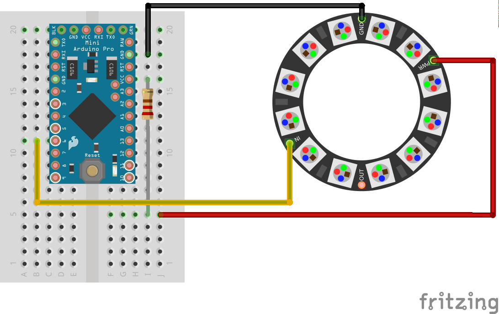

#Flashing Christmas Tree Decoration

This project is based on the wonderful resources provided by Adafruit, more specifically their great [uberguide for Neopixels](https://learn.adafruit.com/downloads/pdf/adafruit-neopixel-uberguide.pdf)
Follow their guide to install the necesary libraries for Arduino.

###For this project you will need.

* An Arduino Uno, Pro Mini, Leonardo or other Arduino compatible device.
* A neopixel ring with 12 RGB LED (You can go larger, and I will show where to change this value in the code)
* Wire to solder the neopixel ring.
* 220 ohm resistor (RED, RED, BROWN)
* Breadboard, optional.

###To build
Solder three wires to your neopixel.

1. VCC (5V Power, also labelled as PWR)
2. GND (Ground)
3. DIN (Data In, also can be labelled as IN)

With the wires soldered, connect 

1. Attach GND to the Arduino GND
2. Attach DIN to Arduino pin 6

For the power, run a 220 ohm resistor inline from the Arduino power to the neopixel power wire. A breadboard makes this very easy to do.

Refer to this diagram to see how I wired the project using my Arduino Pro Mini.


You can also optionally use an inline 220 ohm resistor between the DIN and pin 6 to protect the neopixel from power spikes.

###Software
Install the Arduino neopixel library provided by Adafruit.

With the library installed we start work on the code.

To use the library inside of our code we need to include it

```Arduino
#include <Adafruit_NeoPixel.h>
```


